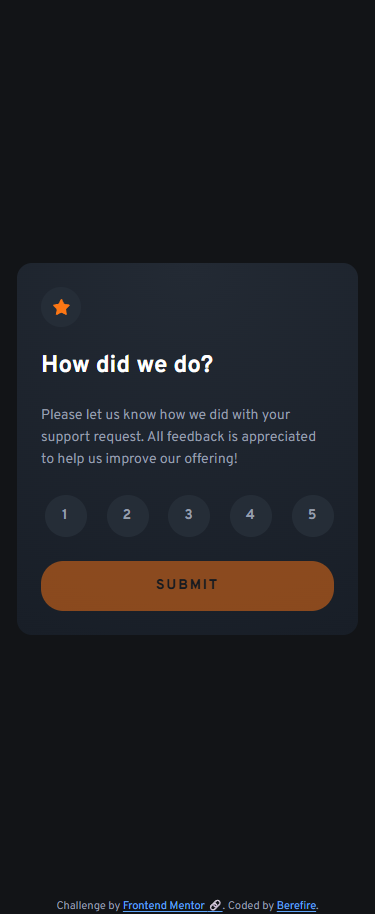
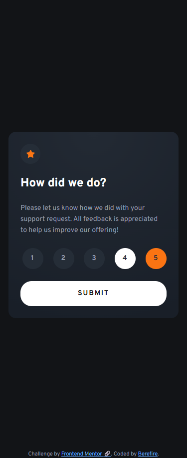
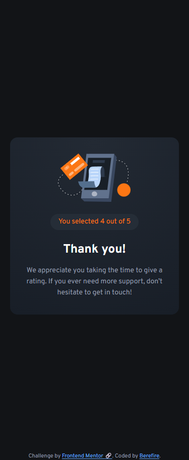
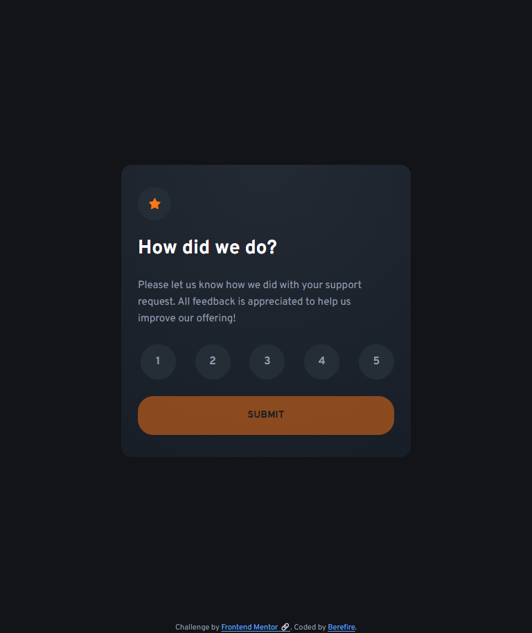
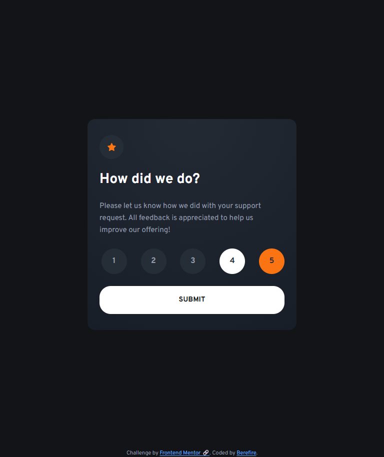
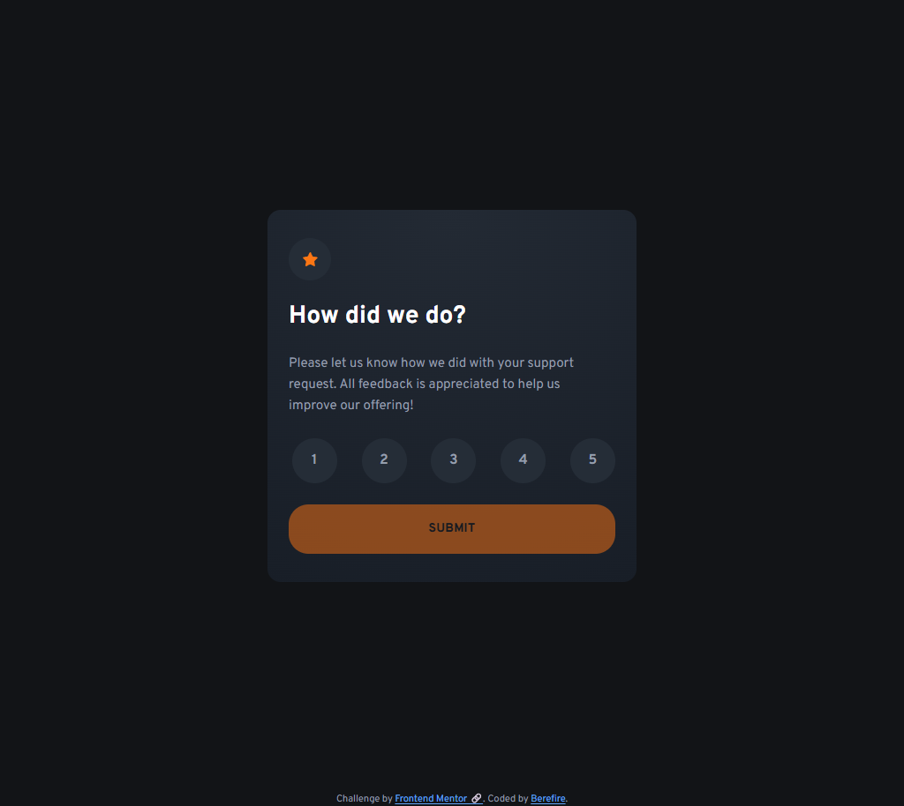
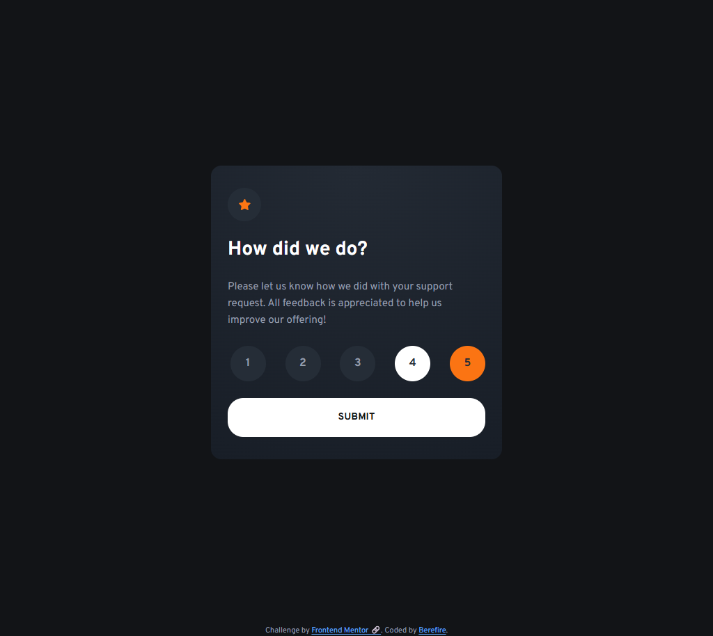
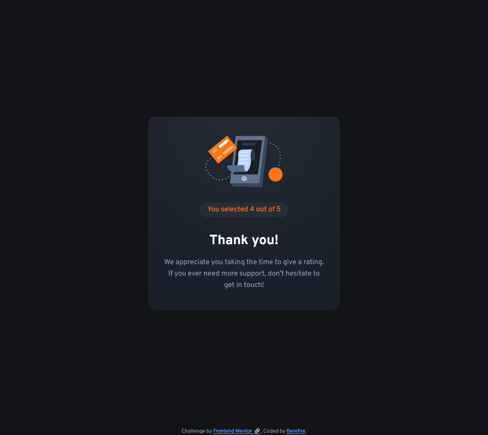

# Frontend Mentor - Interactive rating component solution


[](https://www.frontendmentor.io/)
[](https://vitejs.dev)


This is a solution to the [Interactive rating component challenge on Frontend Mentor](https://www.frontendmentor.io/challenges/interactive-rating-component-koxpeBUmI). Frontend Mentor challenges help you improve your coding skills by building realistic projects.

## Table of contents

- [Overview](#overview)
  - [The challenge](#the-challenge)
  - [Screenshot](#screenshot)
  - [Links](#links)
- [My process](#️my-process)
  - [Built with](#built-with)
  - [What I learned](#what-i-learned)
  - [Continued development](#continued-development)
  - [Useful resources](#useful-resources)
  - [AI Collaboration](#ai-collaboration)
- [Author](#author)
- [Acknowledgments](#acknowledgments)

---

## 📖Overview

### The challenge

Users should be able to:

- View the optimal layout for the app depending on their device's screen size
- See hover states for all interactive elements on the page
- Select and submit a number rating
- See the "Thank you" card state after submitting a rating

---

### 📸Screenshot

#### Mobile (375x914)

| _Default_ | _Active_ | _Thank you Message_ |
| --------- | -------- | ------------------- |
|  |  |  |

#### Tablet (768x914)

| _Default_ | _Active_ | _Thank you Message_ |
| --------- | -------- | ------------------- |
|  |  |  |

#### Desktop (1024x914)

| _Default_ | _Active_ | _Thank you Message_ |
| --------- | -------- | ------------------- |
|  |  |  |

---

### 🔗Links

- Solution URL: [Add solution URL here](https://your-solution-url.com)
- Live Site URL: [https://berefire.github.io/interactive-rating-component/](https://berefire.github.io/interactive-rating-component/)

---

## ⚙️My process

### 🛠Built with

- Semantic HTML5 markup
- Modern CSS architecture (CUBE CSS inspired)
- CSS custom properties
- Flexbox
- CSS Grid
- Mobile-first workflow
- Vainilla JavaScript (ES Modules)
- Accessible form patterns
- Modular JavaScript architecture

---

### Accessibility Features

This project was built with accessibility in mind:

- Semantic landmarks (`main`, `section`, `form`, `fieldset`, `legend`)
- Accessible radio group structure
- Keyboard-friendly interactions
- Visible focus states
- Screen reader support
- Decorative images hidden from assistive technologies
- Proper button disabled states
- Accessible animated state transitions
- `aria-live` support for dynamic content updates

---

### Architecture

The project follows a modular structure separating concerns between:

- DOM utilities
- UI state management
- Event handling
- Animations
- Component logic

Example structure

```html
src/
├── js/
│   ├── utils/
│   ├── components/
│   ├── ui.js
│   └── main.js
│
└── styles/
   ├── base/
   ├── compositions/
   ├── utilities/
   ├── states/
   └── blocks/
   └── main.css
   
```

---

### 💡What I learned

While building this project, I improved my understanding of:

- Accessible form controls
- Focus management
- DOM state synchronization
- CSS state-driven animations
- Modular JavaScript architecture
- Managing UI transitions with async logic
- Structuring scalable CSS systems

One of the most interesting parts was creating sequential UI transitions between the rating card and thank-you card using reusable animation helpers.

```js
export function show(element) {
  element.hidden = false;

  requestAnimationFrame(() => {
    element.classList.remove("is-hidden");
    element.classList.add("is-visible");
  });
}
```

---

### 🚀Continued development

In future projects I would like to continue improving:

- Accessibility testing workflows
- Advanced animation systems
- Scalable component architecture
- State management patterns
- Performance optimization
- Automated accessibility auditing

---

### 📚Useful resources

- [MDN Web Docs](https://developer.mozilla.org/es/) - excellent reference for HTML, CSS, and JavaScript
- [WebAIM](https://webaim.org/) - accessibility guidelines and contrast checking
- [Frontend Mentor](https://www.frontendmentor.io) - real-world frontend challenges and design files

---

### 🤖AI Collaboration

AI tools were used during development to:

- Review accessibility decisions
- Improve semantic HTML structure
- Refactor JavaScript modules
- Explore animation patterns
- Validate architectural decisions
- Improve maintainability and readability

The collaboration was especially helpful for discussing scalable frontend architecture patterns and accessibility best practices.

---

## 👤Author

- Frontend Mentor - [@berefire](https://www.frontendmentor.io/profile/berefire)
- GitHub - [@berefire](https://github.com/berefire)

---

## 🙏Acknowledgments

Thanks to Frontend Mentor for providing practical challenges that help developers improve real-world frontend skills.

---
